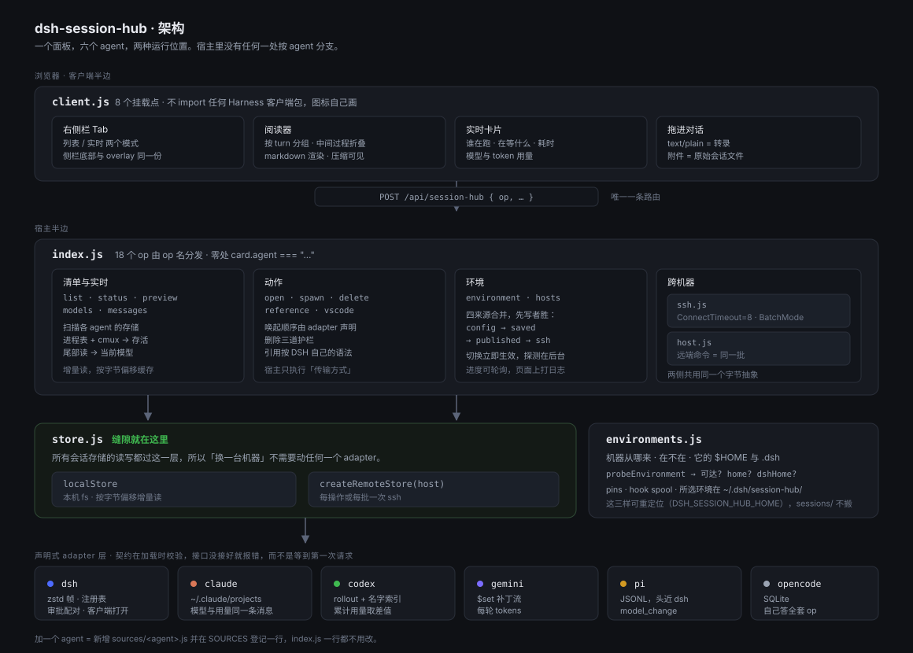

# dsh-session-hub · Agents 会话管理

把**所有 coding agent 的会话**汇总到一个面板里——DSH、Claude Code、Codex、Gemini CLI、pi、opencode——跨全部项目收集。默认看本机，**也可以一键切到另一台机器**：同一个 adapter 层，字节改从 SSH 取。然后：

- **拖进输入框**：把那个会话的完整历史作为文件交给当前 agent，让它自己解析、接着推进。
- **「在此续接」**：把历史物化到当前工作区，并把引用写进当前草稿（等价、更省事的路径）。
- **「在 cmux 继续」/「在 DSH 打开」**：非 DSH 会话用 `cmux new-workspace` 按它自己的 resume 命令唤起；DSH 会话直接在 DSH 里打开。
- **按项目分组、可收起**；**运行中的会话有实时绿点**。
- **配置文件**：每个 agent 自己的配置（`settings.json` / `config.toml` / `.credentials.yaml` …）就地读、就地改，本机和远端同一套。

面向的场景是：**你同时用多个 agent、跨很多项目干活，会话散落在各家的私有目录里**。这个插件负责收集与归一，至于「这个历史该怎么读、怎么接」——交给 agent 自己判断。

---

## 架构



> 矢量图在 [`docs/architecture.svg`](docs/architecture.svg)，可缩放、可直接改。图里刻意画出来的三件事：**唯一一条路由**、**store 缝隙**（换机器不需要动 adapter）、**契约在加载时校验**。

## 架构：op 也是一个契约

宿主的第一步去分支化把**方言**搬进了 `sources/`；同一件事正在**操作**上做第二遍：

```
ops/
├── op.js            # 契约本身：defineOp() 加载时校验 + opRegistry() 拒绝重名
└── environment.js   # environment · hosts · config   ← 已经搬出来的一组
```

```js
export const environmentOps = [
  defineOp({ name: "hosts", store: false, async handle(payload, ctx, host) { … } }),
];
```

**`store` 不是记账，它是一条规则**：「这个 op 会读 agent 存储，因此在环境不可达时必须被拒」。它写在契约里、由宿主在执行前统一施加，而不是指望每个处理函数自己记得。

**op 拿到的是「宿主服务面」**——第三个参数 `host` 里显式列出它被允许触碰的东西（`describeEnvironment`、`activateEnvironment`、`SOURCES`…）。原先它们和宿主同处一个文件，用的是自由变量；显式交接才让这条边界成为真的：**`test/imports.mjs` 会在模块调用了不在面上的东西时失败**。

> 这次拆分踩到的两个坑都值得记：**依赖是靠运行时错误逐个暴露的**（`join` → `environmentState` → `SOURCES`），而 `imports.mjs` 当时只扫 `sources/`、且只统计「被调用」——**不扫新目录、也不认对象字面量的简写属性**。两处都补了。最后还是靠「它与宿主模块作用域的交集」一次算全的，比逐个试快得多。

**迁移是有缝的，不是半成品**：还没搬的 op 仍走同一条 `dispatch` 的下半段，注册表只是先查一次。未知 op 的 `supported` 同时列出来源两处，所以老客户端不会被告知自己正在用的名字不存在。

**已搬出 3 个，还剩 14 个**（`list` / `status` / `preview` / `models` / `messages` / `transcript` / `continue` / `open` / `reference` / `vscode` / `pin` / `spawn` / `delete` / `delete-many`）。

## 架构：一个声明式 adapter 层

宿主半边**不按 agent 分支**。`index.js` 里没有任何 `card.agent === "..."`，也没有 `AGENT_LABELS` / `AGENT_EXECUTABLES` / `SPAWN_COMMANDS` 这类平行表——**所有针对某一个 agent 的知识都在 `sources/<agent>.js` 里**，由一个声明式接口约束。

```
sources/
├── adapter.js     # 契约本身：完整 typedef + defineAdapter() 加载时校验
├── dsh.js         # Zstandard 帧存储、进程内注册表存活、审批配对
├── claude.js      # ~/.claude/projects
├── codex.js       # rollout + session_index.jsonl（删除时要一起摘）
├── gemini.js      # $set 补丁流
├── pi.js          # JSONL，头和 DSH 近乎同构
└── opencode.js    # SQLite，自己实现 list/full/preview/remove
```

**接口是可执行的，不是注释**。`defineAdapter()` 在**模块加载时**校验必填项（`id` / `label` / `executables` / `root` / `resumeCommand`；`build` 与 `list` 必须二选一；`build` 必须有 `match`），所以「接口没接好」在加载时就报错，而不是等到第一次请求才静默少一半功能。

每个 adapter 自己声明方言差异：

| 声明 | 含义 | 谁在用 |
| --- | --- | --- |
| `build` / `match` / `prefix` | 走目录的源：怎么找、怎么增量读、怎么建卡片 | 5 家 |
| `list` / `full` / `preview` / `remove` | **不是「一堆文件」的源**自己答全套 | opencode |
| `storeKind` | `"jsonl"`（可按字节偏移增量读）/ `"frames"`（zstd 帧，只能整份解码）/ `null` | dsh 是 frames |
| `readPreview` | 把 store 尾部折成实时预览的 IN / OUT | 6 家 |
| `readStoreEvent` | 把一个 store 事件折进累积状态：token 总量、**按模型分列的用量**、等待中的审批与工具调用 | claude / codex / gemini / pi / dsh |
| `openPlan` | 唤起这个会话的**有序**方案（`{kind:"app",url}` → `{kind:"terminal"}`）。宿主只执行「传输」，顺序由 adapter 说了算 | 只有 codex 需要声明（先桌面端深链、再终端）；不写就是 `[terminal]` |
| `hydrate` | 需要**第二份文件**的方言：每次扫描、每次 `full` 重读之前先调一次（幂等且便宜） | codex 的 `session_index.jsonl`、gemini 的 `.project_root` |
| `deletePlan` | 删什么、是否目录、删完还要做什么 | dsh 删整个目录；codex 还要摘索引 |
| `liveness` | 存活从哪来：`"registry"`（进程内注册表）还是 `"process"`（进程表） | dsh 是 registry |
| `clientOwned` | 打开会话由客户端负责，而不是拉起终端 | dsh |
| `spawnCommand` | 起新会话的命令；`null` = 本插件起不了 | dsh 是 null |
| `configFiles` | 这个 agent 的配置文件有哪些（路径从 `home()`/`dshHome()` 推，所以自动跟着环境走） | 6 家都有 |

**加一个 agent = 新增一个 `sources/<agent>.js` 并在 `SOURCES` 里登记一行**，不需要改 `index.js` 的任何逻辑。

> 这次重构是分两步做的，因为「接口没接好」的错误很容易被静默吞掉：第一步抽出 `shared.js`（15 个方言无关助手，index.js 净减 176 行），第二步搬 6 个 adapter 并把 index.js 的去分支化做完（2694 → 1574 行）。第二步真的踩到了这个坑——`sources/codex.js` 用了 `readFileSync` 却没导入，而它的 `try/catch` 把 `ReferenceError` 吞了，表现只是「标题静默回落成 (untitled)」。为此加了 `test/imports.mjs`：把每个模块用到的名字与它的导入清单比对，**两个方向都查**——用了没导入（就是上面这个坑）、以及导入了没用（三个 adapter 在读取搬进引擎后仍然整条导入 `node:fs/promises`，而「看起来会碰文件系统」的 adapter 正是后来两个远端 bug 藏身的地方）。它先把注释和字面量剥掉再分析：不这么做，每一句 JSDoc 里的 `@property {() => …} readTail` 都会被读成一次「调用了未定义的函数」。

---

## 环境切换：同一套 adapter，换一台机器

面板顶端有一排环境 chip（**只有配了远端才会出现**，一个选项的开关只是家具）。点一下就换台机器：会话列表、实时预览、阅读器、删除、配置文件全部跟着走，并且**选择记在宿主侧**（`~/.dsh/session-hub/environment.json`），所以换个浏览器、开个新标签页，还是上次那台。

### 机器只声明一次

**机器的清单在这个插件里**，四个来源合并进同一个目录，**先写者说了算**：

| 顺序 | 来源 | 用来干什么 |
| --- | --- | --- |
| 1 | `environments` 配置（`cordis.patch.yml`） | 探针探不出来的东西：`dshHome`、好看的 `label`、或不写进 `~/.ssh/config` 的机器。**同名时以它为准** |
| 2 | 面板里加的（`~/.dsh/session-hub/environment.json`） | 临时加一台 |
| 3 | 别的插件发布的 `remoteHosts` | 兼容路径：有插件知道别的机器时可以把它们交过来（见下） |
| 4 | `~/.ssh/config` | 探到的 Host，不用手写；面板上标出来源 |

**目录里每一行都标出它从哪来**（`来自 ~/.ssh/config` / `来自插件配置` / `由其他插件发布` / `在这里添加`）——不然「忘记这台」在一台由文件拥有的机器上会看起来像坏了。

```
# cordis.patch.yml
config:
  environments:
    - id: pro14uu
      alias: pro14uu        # ~/.ssh/config 里的 Host，原样交给 ssh
      label: pro14
      home: /home/zakl      # 可选；不写就 ssh 过去问
      dshHome: /home/zakl/.dsh
```

**`environments` 里写一条是刻意的修正，不是重复**——比如探针把 `home` 探错了，写下来的那条覆盖探到的那条。

> **兼容路径**：如果**别的插件**发布了 `remoteHosts` 服务（`{ list: () => [{ alias, label, dshHome }] }`），这些机器也会被折进目录，同样先写者胜。
>
> 用 **`ctx.get` 而不是 `inject`** 读它：把一个可选的机器列表写成硬依赖，会让这个插件在「没有那个插件」的组合里**拒绝激活**，代价太重。这和 keep-alive 问 timer 用的是同一个姿势（Cordis 里读未注入的服务属性会抛，`ctx.get` 是唯一正确的「有没有」问法）。
>
> **目录每次请求重算，不在激活时冻结**：几个来源不是一起到的，早读一次就会永远少几台机器。这也是为什么「记住的那台」在解析前先重算目录——否则一个刚出现的 id 会被静默解析成 `local`。

### 这个插件自己的文件放在哪

三样东西属于**插件自己**，而不是某个 agent：置顶（`state.json`）、hook 汇聚的 spool（`hooks.jsonl`）、以及记住的环境（`environment.json`）。它们都在 `$DSH_SESSION_HUB_HOME`（默认 `$DSH_HOME/session-hub`）。

这个变量不是为了配置而配置，它修的是两类真问题：

- **测试不能读你的真实状态。** 环境文件记着「上次切到哪台机器」，而测试是故意读真实会话存储的。两者共用一个位置之后，整套测试就取决于你上次切到哪——远端主机变成已保存环境的那天，每个列出会话的测试都开始死在一条断掉的隧道上，而不是死在它要测的东西上。现在每个这样的测试把自己指到一个临时目录，`sessions/` 照旧是真的。
- **写入端和读取端必须同源。** 改这个路径的时候我把宿主的读取端搬走了、**忘了 `hook.mjs`**——于是 hook 全被追加进一个没人读的 spool。现在两边用同一个基准目录（`DSH_SESSION_HUB_HOOKS` 仍然可以单独指定文件本身，优先级更高）。

### 机器管理：从面板里加机器

环境条上有「⚙ 机器」（右侧栏的工具条里也有一个），打开的是一个机器列表。**它必须在还没配任何远端时就可达**——一个只在已有机器时才出现的切换器，没法用来加第一台。

每一行都标**来源**，这是这个界面最重要的一个字段：

| 来源 | 是什么 | 能做的事 |
| --- | --- | --- |
| 来自 `~/.ssh/config` | 你这台机器的 ssh 已经认识的别名，带 HostName / User / Port | 启用 / 停用 / 测试 / 编辑显示名与远端 home |
| 由其他插件发布 | 另一个插件 `ctx.provide("remoteHosts")` 交过来的机器（兼容路径） | 同上 |
| 在这里添加 | 面板自己记的（`~/.dsh/session-hub/environment.json`） | 同上，外加「忘记」 |
| 来自插件配置 | `cordis.patch.yml` 里的 `environments` | 同上 |

不标来源的话，「忘记」在一个由文件拥有的别名上什么也不会发生——看起来就是坏的。

读 `~/.ssh/config` 而不是让你重新敲一遍别名，是因为**你平时 `ssh` 用的那些别名正是你想切过去的机器**，而那个文件里已经有 HostName / User / Port。通配符（`Host *`）和取反（`Host !x`）**不是机器**：把 `*` 当成切换目标会造出一个名字是通配符的环境。`Include` 不跟进——一个别名只存在于被 include 的文件里，照样可以手输。

两个刻意的取舍：

- **不在界面上改 `~/.ssh/config`。** 那个文件是你的；这个插件只读它，并且把路径显示出来。要加一台 ssh 还不认识的机器，就在面板里加，它进的是本插件自己的状态文件。
- **停用一台机器是「隐藏」，不是「删除」。** `enabled: false` 在合并的最后一步做减法，**不管它是谁声明的**——否则那个开关只对没人提过的机器有效。而在 afternoon 你正在看的那台机器上关掉它，**会把你送回本机**，因为停在一台已经不在目录里的机器上，正是切换器要防的那种状态。

状态文件是 `{version: 2, active, hosts}`。**version 1（只有 `active`）仍然能读**——已经选过机器的人不该因为插件学会了多记一件事而丢掉那个选择。切换机器和添加机器是同一个文件的两次写入，所以 `writeActiveId` 是**读-改-写**，不是覆盖。

`hosts` 这个 op 是**唯一不设可达性护栏**的：它正是你从一台连不上的机器里出来的路，所以必须在那个时候能用。它不读任何会话存储——只读 `~/.ssh/config`、本插件自己的状态文件，和 `remoteHosts` 服务。

### 为什么「加一个 remote 模式」不需要动 adapter

这一点是设计出来的，不是碰巧：**六个 adapter 是纯的**——`build(file, stats, events, truncated)` 拿的是**已经解析好的事件**，`readPreview(event, state)` / `readStoreEvent(event, state)` 折的也是事件。没有任何一个 adapter 直接读字节。

所以「换一台机器」只是换掉两个能力，而「用哪台机器」本身是一个对象：

```
store.js   ← 字节：localStore / createRemoteStore
host.js    ← 命令：localHost / createRemoteHost（它带着 store，所以「一台机器」是一个整体）
```

| 换什么 | 换在哪 | 为什么够 |
| --- | --- | --- |
| **字节从哪来** | `store.js`：`localStore` ↔ `createRemoteStore` | 引擎要的只是 `walk / stat / readHead / readAt / readTail / readFile / remove / writeText / move` |
| **命令在哪跑** | `host.js`：`exec(script)` | 进程表、cwd，以及任何「问对面一句」都走这里——本机是 `/bin/sh -c`，远端是 `ssh host sh -c` |
| **`home()` / `dshHome()` 指哪** | `shared.js` 的一个模块级 scope | 每个 adapter 的 `root()` 和 `configFiles()` 都是从这两个推的，「对面的 `~/.claude/projects` 在哪」一个函数就答完了 |
| **哪些是「本机的事」** | 明确留成本机 | pins、hook spool、`code` CLI、transcript 落盘目录，以及**开窗口**——见下 |

```
store.js          # 字节从哪来：localStore + createRemoteStore
host.js           # 这台机器能做什么：exec / invocation / processes / cwdOf
ssh.js            # ssh 怎么拼：shq() 引号、Buffer 不解码、连接复用、bracketed() 探针哨兵
environments.js   # 有哪些环境、探活、记住选了哪个、以及用户自己加的机器
```

迁移是**可证伪**的：`cachedCards()` 是同一套「按前缀大小分轮、每轮批量取」的算法，本机和远端走同一条路径，只是 round trip 数不同。所以本地清单必须与重构前**逐字节一致**——`smoke` / `preview` / `render` 三个老测试原样全绿，就是这一步的证据。

### 「本机 / 远端」其实是两个问题，不是两个实现

抽象到这里会撞上一个诱惑：把「打开会话」也塞进 `host.launch()`。**那是错的**，而且错得隐蔽：

- **跑一条命令**是**关于对面**的。`ps` 打的是对面的进程表，`cd` 进的是对面的目录。这个必须有远端实现。
- **开一个窗口**永远**是关于这台机器**的。cmux 工作区、Terminal.app、VS Code、桌面深链——对面没有这些东西。变的只是**窗口里承载的那条命令**。

所以 host 只回答「那条命令长什么样、窗口该从哪个目录起」：

```js
// 本机：命令就是命令，窗口开在项目目录里
{ cwd: "/Users/zakl/proj/x", command: "codex resume <id>" }

// 远端：窗口开在本机 home，命令是一整条 ssh
{ cwd: "/Users/zakl", command: `ssh -t 'pro14uu' 'exec "$SHELL" -lic "cd … && exec codex resume <id>"'` }
```

开窗口本身仍然在 `index.js`（`launchInTerminal`），因为它是这条链上**唯一不可能远端**的一环。

`invocation()` 里两件事都必须发生在对面，而且都曾经是「照直觉写就会错」的坑：**`cd`**（会话记录的 `cwd` 是对面的路径，在本机拿它跑 resume，要么失败，要么更糟——成功进了一个恰好同名的本地目录）和**登录 shell**（`claude` 在 `~/.bun/bin`，只有交互式 rc 会把它放进 `PATH`；非交互式 shell 里它是 "command not found"，读起来像「那台机器没装这个 agent」）。

## 远端不能慢：三次测量改掉的三件事

第一版在真机上跑一次 list：**冷 47 秒，热 17 秒**。三个独立的浪费，每个都量过：

| 改什么 | 之前 | 之后 | 为什么 |
| --- | --- | --- | --- |
| **ssh 连接复用**（`ControlMaster` + `%C` + `ControlPersist=60`） | 1.34s / 次 | **0.24s / 次** | 每次 `ssh` 都重新握手 + 认证。一次扫描要问二十几个问题，这一项就是 47 秒里的绝大部分 |
| **一次扫描的 stat 只取一次** | 每张卡一次 ssh `stat` | 0 次 | 批量 `statMany` 已经取回了整批，之后再逐卡问一遍等于把它扔掉 |
| **六个源并发取** | 顺序 6 次 `find` | 一波 | 它们本来就互不依赖。`mapLimit` 保持面板里 agent 的顺序，并让一个坏掉的存储变成「少一个源」而不是「整次扫描失败」 |

实测（对 `215`，18 条会话）：**冷 47.3s → 5.3s，热 16.9s → 2.0s**；本机热扫描 1.6s。剩下的差距就是两台机器之间的距离。

> 连接复用放在 `ssh.js`，因为那是**唯一**一个所有 ssh 调用都经过的地方。socket 用 `%C`（ssh 自己算的 local/remote/port/user 哈希），放在 `/tmp` 而不是 `~/.ssh`——这个插件没有理由往用户自己打理的目录里塞文件。

## 远端也有绿点：liveness 真的过去了

在这之前，存活判断来自**本机**的进程表和 cmux 的记录——所以远端会话**永远不可能**被看成「在跑」。现在 `scanAgentProcesses()` 问的是当前环境：

```js
for (const row of await host().processes()) { … }   // 本机 ps / 远端 ssh ps
```

`ps -eo pid=,etime=,args=` 在 macOS 和 Linux 上输出**同样的三个字段**（`etime` 也都是 `MM:SS` / `HH:MM:SS` / `DD-HH:MM:SS`），所以这里没有平台分支。cwd 也一样：Linux 先读 `/proc/<pid>/cwd`，其他回落到 `lsof`——**用 `[ -d /proc/self ]` 判断有没有 `/proc`，而不是 `[ -e /proc/<pid>/cwd ]`**，后者对普通用户永远是 false，会把每次请求都推去走 `lsof`。

进程缓存按主机 id 记：两张进程表，缓存不说清是哪一张，就会把上一台机器的 agent 显示成这一台的「正在运行」。

实测（在 `215` 上起一个名字叫 `codex`、并声明一个真实会话 id 的进程）：远端 list 报 `runningCount: 1`、pid 正确。那条进程是 **shebang 形态**（`/bin/sh /tmp/codex resume <id>`），正好走「可执行名是 `sh`，要看**第一个参数**」那条路。同一台机器上**别人的** codex 进程没有被认领——它们的 cwd 对不上任何会话。

**这对删除意味着什么**：以前远端删除只能一刀切地要求确认（查不到「还在跑」）。现在能查了，判断变精确：**看见它在跑** → 和本机一样 `code: "running"`；**没看见** → 仍是 `liveness-unknown`，因为远端的 liveness 更弱（只有「进程报了自己的会话 id」或「cwd 对得上」才匹配得到）。**「没看见」不等于「没在跑」**，所以那句确认仍然必要。

### 「打开」在远端是什么意思

为什么远端的默认不是「开一个终端窗口」而是「用你自己的终端 tab」：远端会话本来就只是一条 `ssh -t`，而侧栏那个 tab 是你已经在用的 shell——新开 cmux 工作区或 Terminal.app 窗口反而把上下文打散了。要做到这点，宿主**不能**自己开窗口：tab 和终端视图都活在浏览器里，所以 `open` / `spawn` 在远端默认**把命令交回去**（`kind: "terminal-command"`），由客户端去输。`launch: true` 是同一批 op 的退路，用来让宿主开窗口。

那条链最容易错的是**时序，而且它不报错**：`view.write()` 在视图挂载、attach、变成可写之前是**静默 no-op**——输入没有 attachment 可去。所以客户端会轮询到可写为止，超时就诚实地说出来，退回复制。渲染测试真的点了这个按钮：断言 `openTabFromTarget("terminal", …)` 被调用一次、并且 `write("ssh -t …\n")` 拿到的是带换行的整条命令。


adapter 只说**用什么命令续接它的方言**；「打开」这个动作由宿主按环境翻译：

| | 本机 | 远端 |
| --- | --- | --- |
| 终端 | 直接跑 `codex resume <id>`，在本机开 cmux / Terminal | **打回给客户端**，让它输进这个窗口**自己的终端 tab**（`openTabFromTarget("terminal")` → 轮询到可写 → `write`）；输入不进去才让宿主开 cmux / Terminal，最后才退回复制 |
| 新建会话 | 在项目目录里跑 `codex` | 同理，`cd` 到**对面**的项目目录 |
| 桌面深链 / cmux 聚焦 | 走 adapter 的 `openPlan` | **跳过** —— 两者都是「跑在**这里**的 app」，把远端 session id 喂给本地深链只会打开错的、或者什么都不打开 |
| DSH 会话 | 交给本机的工作区注册表 | **拒绝**，并说明它属于对面那台机器自己的 DSH |

两件事必须发生在对面，而且都曾经是「照直觉写就会错」的坑：

- **`cd`**：会话记录的 `cwd` 是**对面**的路径。在本机拿远端 cwd 跑 resume，要么失败，要么更糟——成功进了一个恰好同名的本地目录。
- **登录 shell**：agent 二进制要用**交互式** shell 去找。`claude` 在 `~/.bun/bin`，只有登录 rc 会把它放进 `PATH`；非交互式 shell 里它是 "command not found"，读起来像「那台机器没装这个 agent」。这个坑最早是在那个已被合并进来的远端插件里踩到的，这里用的是同一个 `$SHELL -lic`。

这条链唯一的风险是**引号**，而引号对不对是读不出来的——所以 `test/remote.mjs` 把生成的字符串**交给真的 `sh`**，让假 `ssh` 报告它到底收到了什么：必须是三个参数，第二个是 alias，第三个是**一整个**远端命令（含带空格的 cwd、嵌套的 `$SHELL -lic`）。要验的正是「手工拼命令」最容易错的地方。

### 三件必须做对的事

**1. 一次性取回来，不是每个文件一次 ssh。** 几千条 rollout 每文件一次 `ssh` 就是几千次 round trip，是分钟级。所以 store 暴露两个可选的批量方法：`statMany(paths)` 和 `readHeads(requests)`（NUL 分隔的记录，内容 base64）。`cachedCards()` 先一次 stat 全体，再**按前缀大小分轮**批量读：第一轮把 `start` 字节发给所有还没解析出信号的文件，只有需要更长前缀的才进入下一轮。一轮一次 ssh。

**2. 「连不上」和「没有会话」必须长得不一样。** 这是切换器存在的**全部理由**。选中一台连不上的机器时，宿主直接拒绝所有读存储的 op：

```json
{"ok": false, "error": "Connection timed out during banner exchange",
 "environment": {"id": "pro14uu", "reachable": false}}
```

**没有 `sessions` 字段**。绝不会把本机的 351 条会话端上去冒充远端；也不会因为读不到就回落成本机。UI 上是一条横幅：哪台连不上、ssh 原话是什么、一个「切回本机」和一个「重试」。

远端探活天然比本机弱：远端是「ssh 过去 `printf $HOME` 有没有回话」，本机是「就是这台」。所以探活只回答「读不到吗」，进程表/liveness 的语义差异在远端仍然存在。

**3. 探针的输出不能被 rc 噪声污染。** 交互式 rc 会打印 motd、版本管理器横幅、`git status`。探针脚本用两个相同哨兵把真正的负载夹在中间，只读中间那段：

```sh
printf '\n%s\n' '__dsh_session_hub__'; ( <脚本> ); printf '\n%s\n' '__dsh_session_hub__'
```

**那个子 shell 不是装饰**。探针脚本末尾有 `exit 0`（某个 agent 的存储不存在时不让整条 ssh 非零退出），而裸的 `exit` 会在**打印收尾哨兵之前**结束 shell——一个完全正常的回答就变成了「no output」。这个 bug 真的发生过，是 `test/remote.mjs` 抓出来的。

### 远端读的是字节，解析仍在本地

对面**什么都不用装**。远端只跑 `find` / `stat` / `head` / `tail` / `cat` / `rm` / `base64`——都是 POSIX 工具，不需要 node、不需要装一遍 session-hub、不需要对面有 `dsh`。方言知识（zstd 多帧、codex 的 `session_id` vs `id`、gemini 的 `$set` 补丁流）一行都没有离开本机。

两个已知边界：

- `stat -c '%s|%y|%w'` 是 GNU 形式（`%y` 带纳秒）。远端按 Linux 假设；macOS 上 `test/remote.mjs` 用一个 `stat` shim 翻译。用 `%Y`（整秒）会让 `mtimeMs:size` 这个缓存戳在同一秒内的两次追加上看不出变化。
- 远端 liveness 天然更弱：本机是进程内注册表 / 进程表，远端只能是「ssh 过去 `printf $HOME` 有没有回话」。

### 远端删除：查不到「还在跑」就必须要一句明确的话

本机的删除有三条护栏，其中一条是「这个 agent 还在跑，不许删」。**这条护栏在远端根本不可能生效**：liveness 来自本机的进程表和 cmux 的记录，两者都看不见对面的进程。放着不管的结果最糟——卡片看起来是空闲的、删除成功、一个还在跑的 agent 的日志没了，而且**没有任何地方会提醒你**。

所以远端删除分两种情况：

- **查得到它在跑**（进程报了会话 id，或 cwd 对得上）→ 和本机一样 `code: "running"`，一句「还在运行」，不绕弯子；
- **查不到** → `code: "liveness-unknown"`，指名哪台机器，拿到明确的「我知道」（`force: true`）才放行。

区分这两者是刻意的：**「没看见」不等于「没在跑」**，但如果连「看见了」都还含糊其辞，用户就学不到该信什么。

`delete-many` 是这里最容易漏的地方：它的循环对每个 key 都传 `force`（运行中的那些已经在上面被过滤掉了），所以**逐会话的检查永远不会被走到**，整批会直接穿过去。因此这条拒绝写在批量入口，而不是指望下面的循环。

客户端的删除弹窗在远端环境下**先要求勾选**才让按钮可用——「拒绝之后再告诉你为什么」是更差的告知方式。

`test/remote.mjs` 两条都钉住了，而且是**真的删掉远端文件**：拒绝时不带 `deleted` 字段（证明循环没跑）、放行时 `target` 是远端路径、文件确实消失、**对面的 `session_index.jsonl` 也通过同一个 store 被摘干净了**。把批量那道守卫删掉，测试立刻变红。


### 字节谁读：`frames` 存储的特殊那条

JSONL 存储是**可按下标读**的，所以引擎读前缀、解析事件、把事件交给 adapter。DSH 的存储是 zstd 帧串联，**不可按字节定位**，所以根本没有「前缀」这回事——它必须整份读。

第一版里这个「整份读」是 **adapter 自己做的**，用 `node:fs`。于是它成了唯一一个绕过 store 的读，而且 `buildDsh` 还是 `async`——**六个 adapter 里唯一违反「`build` 同步」契约的那个**。后果在远端很具体：读的是本机路径，抛 ENOENT，然后那条会话**从清单里静默消失**。不是报错，是「对面的 DSH 没有会话」——正是这个插件最不该犯的那类错。

现在的分工是明确的：**引擎读字节，adapter 只解码**。

```js
// index.js
if (source.storeKind === "frames") {
  return source.build(file, stats, await store().readFile(file));   // ← 走活动 store
}
```

所以 `build` 的第三个参数有两种含义（契约里写清了）：可前缀读的方言拿到**已解析事件**，`frames` 方言拿到**整份 `Buffer`**。`buildDsh` 因此也变回了**同步**函数。

`test/remote.mjs` 里那条 DSH fixture 是**两帧**的 zstd（单帧会被普通的 `zstdDecompressSync` 解出来，看不出差别），而且只存在于合成的远端 home 里。**把这段分支临时删掉，测试立刻从 5 条会话变成 4 条**——这条 bug 是本机任何 fixture 都抓不到的，因为本机的路径恰好是对的。

### 需要第二份文件的方言：`hydrate`

Codex 的线程名在它自己的索引里（`~/.codex/session_index.jsonl`），Gemini 的项目根镜像在 `.project_root` 里。`build` 按契约是**同步**的，所以这些读不能发生在它内部；而直接 `node:fs` 读会在面板指向另一台机器时读**本机**——远端每一行 Codex 都会变成 `(untitled)`。

所以契约里有一个预热钩子：

```js
// sources/codex.js
async function hydrateCodex({ store }) { /* 通过活动 store 读索引，进模块级缓存 */ }

export default defineAdapter({
  hydrate: hydrateCodex,   // 每次扫描、以及每次 full 重读之前调用一次
  build: buildCodex,       // 同步，只查缓存
});
```

`hydrate` 拿到的是**和其他所有读同一个 store**，所以它自动跟着环境走。它是**幂等且便宜**的：Codex 的索引按 mtime + size 失效，Gemini 的 `.project_root` 用 5 秒 TTL——本地（逐文件）路径会给每个会话调一次，不能在每次调用时重读两个文件。

`test/remote.mjs` 用**能区分真假**的 fixture 钉住它：远端索引里的线程名刻意不同于 rollout 首条消息的兜底标题，`.project_root` 刻意不同于目录名——所以「读了本机」和「读了对面」不可能同时通过。

---

## 配置文件：就地读写每个 agent 自己的配置

面板头部（或右侧栏）点「配置」，列出每个 agent **自己声明的**配置文件，带存在性与大小；点开就地编辑、保存。远端环境下路径自动指向对面的 `~/.claude/settings.json`——因为 adapter 的 `configFiles()` 和 `root()` 一样从 `home()` 推。

```js
// sources/claude.js
configFiles: () => [
  { path: join(home(), ".claude", "settings.json"), label: "settings.json", language: "json", creatable: true },
  { path: join(home(), ".claude", "CLAUDE.md"),     label: "CLAUDE.md",     language: "markdown", creatable: true },
],
```

两条护栏：

- **路径围栏**：读/写只接受 adapter 声明的**整条路径**（不是前缀，不做路径解析）。一个接受浏览器传来的路径的查看器，等于在这台机器上、并且在切到环境后**在另一台机器上**开了任意文件读写。声明的路径之外一律拒绝。
- **先备份**：写之前把旧内容拷到 `<path>.dsh-session-hub.bak`。这是别人真实的配置，编辑器一旦发出请求就没有撤销。备份路径在响应里返回并显示出来。

`.` 开头带凭据的文件（`.credentials.yaml`）标 `sensitive: true`：**打开它不会显示内容**，要再点一次「显示」。面板被打开不等于密钥上屏。

创建也支持：`creatable: true` 的文件不存在时可以直接编辑并保存，父目录会被创建（`~/.config/opencode/opencode.json` 通常就还没被创建过）。

---

## 它从哪里收集

| agent | 存在哪 | 格式 |
| --- | --- | --- |
| DSH | `~/.dsh/sessions/<slug>/<sessionId>/session.v4.jsonl.zstd` | Zstandard（**多帧串联**）+ JSONL |
| Claude Code | `~/.claude/projects/<slug>/**.jsonl` | JSONL |
| Codex | `~/.codex/sessions/YYYY/MM/DD/rollout-*.jsonl` | JSONL |
| Gemini CLI | `~/.gemini/tmp/<project>/chats/**.jsonl` | JSONL（`$set` 补丁流） |
| **pi** | `~/.pi/agent/sessions/<slug>/<时间戳>_<id>.jsonl` | JSONL（头和 DSH 近乎同构） |
| **opencode** | `~/.local/share/opencode/opencode.db` | **SQLite**（`session` / `message` / `part` 三张表） |

六家的格式互不相同，解析器各自独立。实测本机 **367 个会话**（DSH 17 / Claude 35 / Codex 276 / Gemini 10 / pi 29 / opencode 0）。

### 临时工作区不算项目

有些工具会在**一次性的临时目录**里跑 agent。本机的 `avp-agent` 就是：它每次运行在 `~/blueai_tmp/avp-agent/cc_sessions/<uuid>/` 下起一个 Claude，于是 `~/.claude/projects` 里留下一批这样的会话记录。

这些**不是项目**：目录名是裸 UUID（表头就成了 `c995b594-d09c-43b3-b574-28e9a9df9da1` 这种东西），而且那个工作目录对「回到原 agent 继续」毫无意义。不处理的话，光这一个工具就给面板塞进 **17 个假项目**。

判定规则是**工作目录的 basename 是裸 UUID**——不是写死某个路径，所以别的工具做同样的事也覆盖得到。实测全库 414 个会话里 **41 个命中，其余一个都不中**，所以这条规则不牺牲任何真实项目。

被排除的数量**不静默丢弃**：每个源在 `list` 的 `sources` 里都会报告 `skipped`，测试也断言 `parsed + skipped === total`。实测 claude 源 `35/76, skipped=41`。

**opencode 是唯一一个不是「一堆文件」的源**：它整库存在一个 SQLite 里，所以那一项不走「遍历目录」的形状，而是自己实现 `list` / `full` / `preview` / `remove`，按 session id 查询、读取、删除（三张表的删除包在一个事务里）。读用 `node:sqlite`（运行时自带，**惰性 import**，所以机器上没有 opencode 或 Node 较老时这里就是空列表）。它也是唯一一个**自带 AI 标题**的源——标题直接来自 `session.title` 列。

### 标题从哪来

每个 agent 都有自己的自动命名，能抓的都抓了——**优先级从高到低**：

| agent | 标题来源 | 说明 |
| --- | --- | --- |
| DSH | `session/title` 事件的**最后一个** | 官方契约是「三源（`fallback`/`provider`/`user`）**最新者胜**」，所以取最后一条；我最初只取了第一条，那是错的 |
| Claude Code | `ai-title` 事件的**最后一个** | Claude 会随对话演进重新生成，取第一条会把早期猜测冻住 |
| Codex | **`~/.codex/session_index.jsonl` 的 `thread_name`** | Codex 把模型生成的线程名写在这个索引里，**不在 rollout 文件里**——205 条有名字，如「编写 SkillStudio 使用说明」 |
| Gemini CLI | 无 | 只有 `$set.summary`（原始模型响应），不是标题 |

拿不到时按序兜底：**首条真实人类消息 → 第一条助手回复 → `(untitled)`**。

两类需要特别处理：

- **注入内容被当成标题**。实测抓到 Codex 的 `<codex_internal_context>`、`<codex_delegation>`、`## Referenced chats`、`## Code review guidelines`、`# AGENTS.md instructions`；Claude 的 `<local-command-caveat>`、`<teammate-message>`、`## Context Usage`；以及 DSH 自己的 `Current runtime context`。通用规则是「以含 `-`/`_` 的尖括号标签开头」，所以用户粘 `<div>` 仍算他自己的话。
- **子 agent 会话没有人类回合**。DSH 会用 `origin: "subagent"` / `delegationDepth > 0` 标出来，它的「首条用户消息」其实是父级委派的 prompt（"You are researching…"），不该当标题——这类改用**第一条助手回复**（"I'll research the DSH plugin API…"）。

效果：`(untitled)` 从 **67 个降到 6 个**（共 378 个会话）。

### 各个格式里踩到的坑（都已处理）

- **DSH 的 zstd 是多帧串联的**。`zlib.zstdDecompressSync` 只解第一帧（212 字节），必须按魔数逐个定位帧边界并串联解码。魔数出现在压缩数据内部不会出错：在那里截断的切片解不开，会自动尝试下一个边界。
- **`FileHandle.read` 会短读**。不循环读满，前缀会比预期小一个数量级，标题和消息会凭空丢失。
- **前缀读取必须丢弃被截断的尾行**，否则一条长记录会让整行 JSON 解析失败。
- **Codex 的真实提问在 61KB 之后**。开头是 `session_meta` 与 `base_instructions`，所以读取要按需增长，而不是固定读一块。
- **agent 会把注入内容写成 user 消息**，而它们会被当成会话标题。实测抓到：Codex 的 `# AGENTS.md instructions`、`<environment_context>`、`<codex_internal_context>`、`<codex_delegation>`、`## Referenced chats`、`## Code review guidelines`；Claude 的 `<bizContext>`、`<local-command-caveat>`、`<teammate-message>`、`## Context Usage`。这些既不能当标题，也不该淹掉 transcript。通用规则是「以带 `-`/`_` 的尖括号标签开头」，因此用户粘贴 `<div>` 仍算他自己的话。
- **Gemini 的消息列表在文件末尾**（最后一条 `$set.messages`），但中间还夹着逐条追加的消息对象，前缀读取和完整读取要走不同的取法。
- **有些会话根本没有人类回合**（委派/自动化跑起来的）。标题退回**第一条助手回复**，比 `(untitled)` 有用得多——本机 `(untitled)` 从 67 个降到 7 个。

### 两条读取路径

- **列表**：读一个**按需增长的前缀**（128KB 起，最多 2MB），拿到「记录头 + 第一条真实人类消息」就停。所以 `messages` 在卡上是下界，卡会以 `partial: true` 标出来，UI 显示成 `12+ 条消息`。
- **transcript**：读**整个文件**再渲染。列表里看到的 `partial` 不影响它。

---

## 置顶

**项目**和**会话**都能置顶，而且**会话置顶是在它所在的项目内置顶**——只浮到该分组的最上面，不会跑到整个列表顶部。

| | 入口 | 表现 |
| --- | --- | --- |
| 会话 | 标题右侧的图钉格：**已置顶时常亮**（蓝色实心），未置顶时只在**行悬停**时出现（空心） | 在该分组内排到最前；分组排序不受影响 |
| 项目 | 表头悬停后出现在 🗑 左边的图钉按钮 | 整个分组排到最前；表头有一个常亮的图钉标记 |

图钉格是**它自己的开关**，没有再往悬停操作区塞第四个图标。项目置顶优先于分组大小排序；会话置顶优先于时间排序，**同一档内仍按时间倒序**（`Array.sort` 是稳定的）。

**状态存在插件自己的文件里**，不借用任何 agent 的存储：

```
~/.dsh/session-hub/state.json
{ "version": 1, "projects": ["<工作区完整路径>"], "sessions": ["<会话 key>"] }
```

理由：四家 agent 没有一个现成的「pinned」概念可以借用，而往别人的存储里塞自己的偏好是越界。写文件走**临时文件 + rename**，中断不会丢光全部置顶。

**删除会顺手清理置顶**：会话被删后它的 pin 也会摘掉（批量删除只写一次文件，不是每个会话写一次），所以状态文件不会长出指向空气的条目。

---

## 在项目里新建会话

项目表头的 **＋** 打开一个选择器：**DSH / Claude Code / Codex / Gemini CLI / pi / opencode**，选哪个就在**那个项目目录**里把那个 agent 跑起来。

两条启动路径，因为归属不同：

| Agent | 怎么启动 | 为什么这样 |
| --- | --- | --- |
| **DSH** | 客户端走 DSH 自己的工作区注册表：按路径找已有工作区（没有才 `workspaces.create({ path })`），然后 `uiWorkspace.openWorkspace(workspaceId)` | DSH 会话属于工作区注册表，不属于某个 shell。`openWorkspace` 是 DSH 原生的「新会话」语义——**它自己会复用该工作区里已有的空白会话，或新建一个**——所以这里不用自己拼 |
| Claude / Codex / Gemini / pi / opencode | 宿主在**该目录**下用 `cmux new-workspace --cwd … --command <agent>` 起一个 | 这些 agent 就是命令行程序；cmux 不可用时退 Terminal.app，再不行把命令复制到剪贴板 |

**为什么 DSH 不走同一条路**：它没有命令行入口，会话是由工作区创建的。把两者混成一个「spawn」概念会在任一侧失真——所以 `spawn` 这个宿主操作**明确拒绝 DSH**，由客户端自己处理。

**＋ 只在「按项目」分组时出现**：按 agent 分组时没有「项目」可谈，那个控件就不渲染（渲染测试里断言了项目表头恰好四个控件）。

---

## 用 VS Code 打开项目

项目表头的 **`<>`** 把该项目目录交给 VS Code：宿主跑 `code <目录>`。

**刻意不走终端**（不像启动 agent 那样）：`code` 会把路径交给**已经打开的窗口**，走终端只会在它后面留一个白开的 shell。

CLI 定位是 **PATH 优先**，再依次退回 `/usr/local/bin/code`、`/opt/homebrew/bin/code`、app bundle 内的路径——**从 Finder 启动的宿主不继承登录 shell 的 PATH**，只查 PATH 会漏。相对路径直接拒绝；CLI 找不到时如实报错，不静默失败，也不假装成功。

---

## 引用到会话

会话行右侧的 **@** 把这条会话插进当前输入框：

| 情况 | 插进去的是什么 |
| --- | --- |
| **DSH 会话** | 走 DSH 原生的 mention 服务（`sessionReferenceResolver`，签名已核实），是**真正的会话引用**，不是一段文本 |
| 其余 agent | 按 DSH 自己的 mention 语法（`formatFileMention`，逐字符对齐）补一个 `@<原始会话文件路径>` |

**能拿到原始会话文件就给文件**——那是 adapter 的 `sessionFile` 契约（见「结构」一节），拿不到就退化成文字，并在返回值里说明是哪一种（`kind` 为 `mention` / `file` / `none`）。

---

## 删除会话

行末的 🗑 会打开一个**确认弹窗**（显示标题、agent、即将删除的确切路径），确认后才动手。**项目表头悬停时也有一个 🗑**，一次删掉该项目下的全部会话——跨所有 agent。删除的是**原始 agent 自己的存储**：

| agent | 删除目标 |
| --- | --- |
| DSH | `~/.dsh/sessions/<slug>/<sessionId>/` —— **整个目录**（含 `session.v4.jsonl.zstd` 与 `session.lock`） |
| Claude Code | `~/.claude/projects/<slug>/<sessionId>.jsonl` |
| Codex | `~/.codex/sessions/…/rollout-*.jsonl`，**外加从 `session_index.jsonl` 摘掉它的 `thread_name` 条目**（否则会留下一个指向已删会话的名字） |
| Gemini CLI | `~/.gemini/tmp/<project>/chats/*.jsonl` |
| pi | `~/.pi/agent/sessions/<slug>/<时间戳>_<id>.jsonl` |
| opencode | **不是文件**：`delete from part/message/session where session_id = ?`，三句包在一个事务里 |

### 整项目删除

- 弹窗列出**项目路径、会话总数、涉及的 agent**。
- **正在运行的会话默认跳过**，不阻断整批——批量删除应该删掉能删的、然后如实报告剩下的。弹窗会说明跳过了几个，并给一个「同时删除这 N 个运行中的会话」勾选项。
- 结果显示为「已删除 N 个，跳过 M 个」。
- 重复提交同一批是安全的：已删掉的 key 报为 **skipped，不是错误**。

> **一条真实的数据缺陷，顺手修了**：分组原本按项目**目录名**（`cwd` 的最后一段）做键。这台机器上有**三个不同目录都叫 `new-chat`**，会被合并成一组——按显示名删就会跨三个项目误删。现在分组键是**完整工作区路径**，显示名只用于展示，完整路径放在表头 tooltip 上。

### 三条护栏

删除不可逆、且落在工作区之外，所以宿主侧有三道检查（`test/delete.mjs` 逐条验证）：

1. **key 必须能解析成本插件真正列出来过的会话**；
2. **目标路径必须在该 agent 自己的存储根之内**——`~/.claude/history.jsonl` 这种同目录下但不在 `projects/` 里的文件会被拒绝；
3. **进程还活着的会话拒绝删除**，除非调用方显式传 `force`。单条删除时 UI 把按钮变成红色的「仍然删除」；批量删除时改成勾选框。

批量接口还多一层：**单次最多 2000 个 key**，防止一个失控的请求走遍磁盘。批量删除**只删调用方发来的那些 key**——也就是你**看到的那一批**。所以开着 agent 筛选或搜索时，「整组删除」删的是筛选后的那一组，而不是筛选前。

Codex 的索引是**先写临时文件再 rename** 重写的，写到一半被打断不会把索引截断。

**刻意没做的事**：cmux 的 hook 记录不动。它按 session id 索引，只是给卡片做装饰；卡片的文件没了，残留记录就是惰性的。而那个文件 cmux 自己也在写，去改它才真的有风险。

> 删除 DSH 会话时如果 DSH 正开着它，界面可能报错——这是删掉别人脚下文件的本性。运行中的会被护栏挡住，但「已关闭却仍挂在界面里」的会话仍需你自行刷新。

---

## 实时运行状态

**主来源是进程表，不是 cmux。**

| 来源 | 覆盖 | 判据 | 需要配合吗 |
| --- | --- | --- | --- |
| **进程表** | Claude / Codex / Gemini / pi / opencode | `ps -axo pid=,command=` 里那个进程是否真的在跑 | **不需要**——直接开在终端里的也看得见 |
| DSH `ctx.agents` | DSH 会话 | 进程内 agent 注册表的 `status === "running"`，精确 | 不需要 |
| cmux hook 记录 | cmux 启动的那些 | 记录里的 **PID 是否存活** | 只在 cmux 里跑的才有 |

### 进程表怎么映射到会话

1. **命令行里带会话 id** → 直接对上：Claude / Gemini 是 `--resume <id>`，Codex 是 `resume <id>` 子命令，pi 是 `--session <id>`，opencode 是 `--session <id>`。
2. **新开的、命令行里没有 id** → 用 `lsof -a -p <pid> -d cwd -Fn` 取它的工作目录，配上**该目录下最新的那个会话**——对刚启动的 agent 来说，那正是它自己建的那个。

匹配的是**可执行名和第一个参数**，而且用**分隔符界定**（`(?:^|[-_.])pi(?:$|[-_.])`）而不是子串包含——否则 `apiserver` 会被当成 `pi`，`xcode` 会被当成 `codex`。只看第一个参数是为了让扫描进程自己（一个跑 `ps` 的 `node`）以及**任何后面才提到 agent 名字的参数**都不被误判。

**两个踩到的坑**：

- **只匹配可执行名不够。** macOS 把 shebang 脚本报成 `/bin/sh /path/to/pi-selftest`——可执行名是 `sh`，脚本路径在参数里。cmux 那种 wrapper 同理（`node /path/to/claude-wrapper`）。所以第一个参数也要看。这是我把「直接跑 `/opt/homebrew/bin/pi` 能认出来」误当成「所有启动方式都能认出来」时留下的洞。
- **`lsof` 报的是规范路径。** macOS 上 `/tmp` 是 `/private/tmp`、`/var` 是 `/private/var`，而会话记录里存的可能是未解析的那个。直接比字符串永远不相等。现在两边都用 `realpath` 解析后再比（带缓存，只在直接匹配失败时才走这条路）。

> 一开始我**只用 cmux** 判断存活，这是个错误的前提：你很多 agent 是直接开在终端里的，cmux 根本没有它们的记录。现在 cmux 降级成「补充来源」——它仍有用，因为它的记录同时带 session id 和 pid，能补上进程表推不出来的映射。

> **另一个踩到的坑**：cmux 的 `agent_lifecycle` 字段**不可信**。实测 11 条记录里 8 条写着 `"running"`，但对应 PID 全都早就死了——那是 `Stop` 钩子没触发留下的。**真正的判据始终是进程是否存在**（`process.kill(pid, 0)`，`EPERM` 也算活着），`agent_lifecycle` 只作旁证。

面板打开时每 3 秒轮询一个**只读实时状态**的轻量操作：不重扫目录、不重新解析，只在已经解析好的卡片上重算存活状态。可以点「只看运行中」过滤。

**实测**：你新开的那个 `claude --resume 7d5d2d45-…`（cmux 里没有它的任何记录）现在被进程表识别为 `source: "process"`，并正确挂到了它的会话上。

---

## 实时预览

右侧栏那个 tab 有**两个模式**：**列表**（会话清单）和**实时**（正在跑的 agent）。

实时模式是**一格格方块**——每个运行中的 agent 一格，**每格都带那条会话的标题**（没有标题的网格只说明「有东西在跑」，说不清在跑什么）——**点任意一格展开它的详情**。宽度用 `repeat(auto-fill, minmax(152px, 1fr))`，所以在窄栏里是两列、宽处自动变多，不是写死的尺寸：

```
● 实时 · 3 个运行中                            点方块看详情  [↻]
┌───────────────────┐ ┌───────────────────┐
│ ● Claude Code  2m │ │ ● Codex   刚刚 ⚠  │
│ 我想做一个插件，在 │ │ 编写 SkillStudio  │
│ 你这里一次性管理… │ │ 使用说明           │
│ work_tree_dev     │ │ gagent             │
└───────────────────┘ └───────────────────┘

┌────────────────────────────────────────────────────────┐
│ ● Codex  gagent              [↓] [↗] [✕]              │
│ 编写 SkillStudio 使用说明                                │
│ 目录       /Users/zakl/projects/gagent                  │
│ 运行时长   2m · 3:39:35 PM                              │
│ Token 用量 输入 18.0k · 输出 1.2k · 缓存 26.7k · 合计 45.9k │
│ 等待中     等确认 · bash                                 │
│ IN        设计 Hook 主动事件 API                         │
│ OUT       方案已先冻结并落盘，暂不继续实现…               │
│ 从它自己的会话记录读取                                    │
└────────────────────────────────────────────────────────┘
```

方块用来扫「有什么在跑」，详情面板用来回答需要空间的问题。详情里的每个动作与清单里的一行**完全一致**：**在此续接**、**用原 agent 继续**、以及**拖进输入框**——两个模式共用同一套动作函数和同一套拖拽载荷。

### 详情里的每个数字从哪来

| 字段 | 来源 | 精确度 |
| --- | --- | --- |
| **目录** | 会话记录里的 `cwd` | 事实 |
| **运行时长** | 进程表的 `etime` 列（`ps -axo pid=,etime=,command=`） | 事实 |
| **Token 用量** | 见下表 | 事实（累加） |
| **等待中** | 见下下表 | DSH 是事实，其余是推断 |

**Token 用量按 agent 各自的方言累加**——没有一种是猜的：

| agent | 来源 | 形态 |
| --- | --- | --- |
| Claude Code | 每条 assistant 消息的 `message.usage` | 逐条**累加** |
| Codex | `event_msg` / `token_count` 的 `info.total_token_usage` | **本身就是累计值**，取最新一条 |
| pi | 每条 assistant 消息的 `message.usage` | 逐条**累加** |
| **DSH** | **没有** | DSH 的会话事件里**没有 token 事件**，只有 `tokenMeter.measure(session)`，而那需要活的 `Session` 对象——本插件的扫描器只有文件。所以 DSH 显示「无」而不是编一个数 |

**「等待中」区分事实与推断**：

| agent | 信号 | 性质 |
| --- | --- | --- |
| **DSH** | 会话里的 `approval/asked` 与 `approval/decided` **按 `data.id` 配对**；问了没答 = 真的在等确认 | **事实**，还能报出在等哪个工具 |
| Claude Code | 有 `tool_use` 没有配对的 `tool_result` | **推断**：可能在跑，也可能在等确认，所以只写「工具进行中」 |
| Codex | 有 `function_call` 没有配对的 `function_call_output` | 同上 |

### 只显示回答，不显示思考

预览的 OUT（以及转录、标题回落）走同一个取文本的规则：**只取可见正文，跳过模型的内部推理块**。

这件事对 DSH 尤其重要——它的 `reasoning` 块**也带 `text` 字段**：

```json
{"type": "reasoning", "text": "The user wants a plugin to manage..."}
```

所以「凡是带 text 的块就当正文」会把模型的自言自语当成它的回答。实测本机 DSH 日志里 **reasoning 905 块 vs text 386 块**——推理比回答多两倍多，于是每一处预览、每一份转录、每一次标题回落显示的都是思考过程。

现在按块类型显式排除（`reasoning` / `thinking` / `redacted_thinking` / `analysis` / `thought`），**没有 `type` 的块仍然算正文**，所以更简单的形状不受影响。Claude 和 pi 把这类块叫 `thinking`、正文放在 `thinking` 字段里，本来就被跳过了；现在把规则写明白，而不是靠巧合。

实测效果：DSH 转录从 **1,351,906 → 275,216 字符（降 80%）**；Claude 一字未变（403,145）。

### 两个输入 / 输出源，后者优先

| 来源 | 怎么来 | 需要 agent 配合吗 |
| --- | --- | --- |
| **从会话记录推导** | 读每个运行中会话**自己存储的尾部**（DSH 的 zstd 按帧边界切、其余直接切 JSONL），取最后一条人类输入和最后一条助手输出 | **不需要**，开箱即用 |
| **hook 上报** | agent 往 `~/.dsh/session-hub/hooks.jsonl` **追加一行 JSON** | 需要，但只是一行 |

每张卡底部会写明这条读数来自哪个来源，不猜、不混。

### 性能：增量读，不是每次重读

实时视图每 2 秒轮询一次，所以**不能**每次都重读整个转录。JSONL 是只追加的，所以扫描器**记住字节偏移**，每次只解析新增的那一段；累加器（token 总数、待审批集合）跨轮次保留，因此**写到一半的那一行会等它自己写完整**再解析。文件变小说明被轮转或替换了，读取器重置。

**DSH 是例外**：它的存储是一串 zstd 帧、不是纯 JSONL，字节偏移在那里不是行边界。但 DSH 的文件也是最小的那些，所以整份解码、按 `mtime + size` 缓存即可。

> 这里的第一次实现踩了一个坑：`decodeZstdFrames` 返回 **Buffer 而不是字符串**（其他调用点都跟着 `.toString("utf8")`），我漏了，于是 `parseJsonl` 对 Buffer 调 `.split` 抛错——而**被一个过宽的 `catch` 静默吞掉**。测试断言「未答复的审批必须被报出来」时才发现。现在那个 catch 只吞真正的解码错误，其余一律抛出。

---

## 用原 agent 打开：顺序由 adapter 声明

**切换顺序是 adapter 的，传输方式是宿主的。** adapter 声明一个**有序计划**，宿主逐步执行：

```js
// codex 声明「先试桌面端深链，不行再走终端」
openPlan: (card) => [
  { kind: "app", url: `codex://threads/${card.sessionId}`, label: "Codex" },
  { kind: "terminal" },
],
```

**为什么这么分**：只有 adapter 知道自己的 agent 听得懂什么（有没有桌面端、深链长什么样）；而「把 URL 交给系统」「聚焦一个已经开着的终端」「新开一个」这些传输方式对每个方言都一样，属于宿主。

没声明 `openPlan` 的方言默认 `[{ kind: "terminal" }]`——所以 claude / pi / gemini / opencode 什么都不用写。

**一条硬性不变量**：计划必须以 `terminal` 步收尾。否则在没装那个桌面端的机器上，会话就**完全打不开**了。测试守着这条。

终端步内部（宿主）依次是：

1. **已在 cmux 里运行的会话 → 聚焦它那个 workspace**（`cmux select-workspace`），而不是再 resume 一份
2. **在 cmux 里新开 workspace 跑 resume 命令**
3. cmux 没在运行 → **按 bundle id 启动它，然后轮询它的 socket**，就绪后再试一次
4. 都不行 → Terminal.app

> 第 3 步的两个细节都不是随手写的。**按 bundle id**（`com.cmuxterm.app`）而不是 `open -a cmux`，因为后者解析的是「应用文件」，比系统认的身份弱。**轮询 socket** 而不是固定 `sleep`：一个 app 启动要多久不是该猜的东西，而 socket 恰好就是下一条命令需要的东西——它是「启动了」和「能用了」的区别。``waitForCmuxSocket`` 看的是 cmux 自己报的两个路径：`~/.local/state/cmux/cmux.sock` 与 `/tmp/cmux.sock`。

> 第 4 步是补上的。cmux 的整套命令只有**裸的 `cmux <path>` 那种形式**会「launches cmux if needed」，`new-workspace` 需要它**已经在跑**（帮助原文：Create a new workspace in the caller's window）。所以 cmux 关着的时候，每一次「打开」都静默落到了 Terminal.app——看起来就像「没有优先用 cmux」。

**刻意不跑 `codex app`**：那个子命令在桌面端缺失时会拉起安装器，点一下「打开」就下载东西不是好体验。深链要么被处理、要么静默失败。

---

## 阅读一条会话

点行标题打开只读阅读器。它不是把消息平铺出来，而是**按 turn 分组**：

```
● 你            第一个请求                                    2026-10-02 10:00
  ▸ 2 条中间过程                       ← 折叠着
● Claude Code   第一个最终回答                                2026-10-02 10:02

▸ 上下文在此被压缩 · 10:30 · 折叠了 2,735 tokens   ← 折叠着，展开看摘要

● 你            第二个请求                                    2026-10-02 11:00
● Claude Code   第二个最终回答                                2026-10-02 11:01
```

**一个 turn = 一条用户请求 + agent 对此做的全部**，**只有最后一条是回答**，前面的是中间过程（工具调用之间的叙述），默认折叠。一屏能宏观看，点开能看细节——平铺出来的是不可读的（实测某条会话 43 条消息里 216 个工具调用）。

### 行上显示最后使用的模型

会话行标出**最后一次回答用的模型**（`gpt-6-luna`、`blueai-relay-200k/glm-5.3`…），悬停看全名（行里会截断）。

**为什么是尾部读取**：`build()` 只读文件**开头**（拿标题与 cwd），而模型在**结尾**。要在每一行都显示，就得碰每一条 store——但绝不能整份读：本机有单条 16MB 的 Codex 会话，371 条全读就是几百 MB，只为了回答一个答案在末尾的问题。

所以：**尾部优先**（只有尾部能说明「当前」用的是哪个），窗口 32KB，未命中再放宽到 256KB；**仍未命中才读开头 128KB**——因为有的方言只在开头报过一次模型（pi 的 `model_change`，或 Codex 那条 `turn_context` 被后面的大段工具输出顶远了）。

实测覆盖：dsh 21/22、claude 31/32、**codex 257/258**、pi 26/26、gemini 9/10（剩下的确实没有模型标记）。代价 **首次扫描 1.56s，之后 14ms**——按 `(size, mtime)` 缓存，只有变过的会话才重新读。

只取 `reading.model`，**丢弃**尾部读出来的 token 数：没有前面的历史，那些数字没有意义（Codex 的分桶是靠相邻累计值的差算出来的），不能当作会话用量显示。

### 按模型分列的用量

不记「最后一个模型」，而是**每个出现过的模型各记一份用量**——会话中途换模型是常事，只留最后一个会让整段对话看起来都跑在它上面。`reading.models` 是「模型 → 用量」，宿主用 `models` op 回答它，`preview` 与 `messages` 也带出来，所以实时详情面板和阅读器都不需要额外请求。

**分桶放在共享的 `accumulate` 里**：累加会话总量的同一趟顺手按当前模型分桶，一次遍历两个答案，代价为零。

| agent | 模型从哪来 | 用量从哪来 |
| --- | --- | --- |
| claude | assistant 消息的 `message.model`（**与 usage 同一条消息**） | 同一条消息的 `message.usage` |
| pi | `model_change` 的 `provider` + `modelId` | assistant 消息的 `message.usage` |
| gemini | `type:"gemini"` 事件的 `model`（与该轮 tokens 同一条） | 同一事件的 `tokens`——它的 `input` 是**当轮发出的整个上下文**，随对话增长（实测 11,947 → 12,638 → 12,924），所以逐轮相加才是总量 |
| codex | 事件的 `payload.model`（`session_meta` 只有 `model_provider: "custom"`） | `event_msg/token_count`，**是运行总量，不是每轮增量** |
| dsh | `request/header` 的 `data.header.config` | 无，见下 |

**Codex 那个累计值是这里唯一的陷阱**：把「运行总量」归给当前模型，会把**之前所有模型的用量算到最后一个头上**。所以它的分桶取**相邻两次的差**，并把差值归给两次之间生效的模型。

**一条不变量，测试守着**：各模型桶之和必须等于会话总量。它正是抓出下面这个 bug 的检查。

> `total` 不能自己把四项加出来。Codex 的 `cached_input_tokens` **已经包含在** `input_tokens` 里，四项相加会把缓存算两遍：实测 33,472,212 对权威的 16,773,939。现在 `total` 优先用方言自己给的数字，没有才退回相加。
>
> 为什么这个 bug 差点漏掉：早先「claude 分桶与总量完全一致」的验证是**循环论证**——claude 没有源 total，比的是「我自己算的和」与「我自己算的和」。是 Codex 那个权威 total 让它现形。

**Codex 的深链只有一半是证实的**：`codex://` 这个 scheme 由桌面端（`/Applications/ChatGPT.app`，bundle id `com.openai.codex`）注册，app-server 协议里也有 `thread/resume`，但**只有 `codex://threads/new` 被证实**是这个 CLI 构造的；`codex://threads/<id>` 是**推断**。第一次实测它确实拉起了桌面端，但「落在哪条会话上」只有人能看出来——所以它是计划的**第一步**而不是唯一一步，没被处理就落到终端。

**DSH 的用量通道存在但没有数据**：`assistant/attempt` 的流里确实有 `usage` chunk，但本机**全部为 0**（provider 不上报），而且从零值反推不出它是每轮还是累计。**所以不取数**——宁可不显示，也不显示一个没有任何东西测量过的数字。代码注释里写明了这个判断。

### 正文按 markdown 渲染

转录是文章：代码块、列表、强调、表格是 agent 说话的**形状**，把星号原样显示出来是不可读的。

渲染器**产出 React 元素，不是 HTML 字符串**——转录里是这条会话引用过的任何东西，构建元素意味着**里面的内容永远变不成标记**。同理，链接只对 `http/https/mailto` 生成 `<a>`：`javascript:` 会退化成纯文本（它的文字仍然显示，只是不是链接）。这条有断言守着。

覆盖的是 agent 实际会写的东西：围栏代码、标题、有序/无序列表、引用、表格、分隔线、段落；**不认识的结构保持原文**，所以未知语法只是没样式，不会丢。

> 客户端能用的只有 `ctx / React / host / styles / console`（`Builtin.listBuiltins` 查证），Client Service 里也没有 markdown 能力，所以是自己写的，不是重复造轮子。

**时间戳写在轮次标题上**（`## User · 2026-10-02 15:04`），不另开平行列表：一轮和它的时刻因此不可能错位，而且**转录本身也带上了时间**——那份转录是要交给另一个 agent 读的。

### 压缩是可查的

**每次压缩都记为记录里的一道缝**，带三样东西：发生在什么时候、**折叠掉了多少 token**、以及**压缩后替换成了什么**（摘要正文），默认折叠。

摘要写在正文里而不是另列一处，这样它在对话中的**位置是准的**；也意味着交给另一个 agent 的转录会带上「这里压缩过、摘要是什么」。

| agent | 压缩数据 |
| --- | --- |
| **DSH** | `compaction/prune` 给出折叠的 token 数 → `compaction/summary` 给出摘要正文 |
| **Codex** | 单个 `compacted` 事件，`payload.message` 是摘要散文（不带 token 数） |

---

## 热重载与重启

客户端半边改完即时生效（插槽占用者会重新注册）。**宿主半边**有一个容易踩的坑：

`ctx.connection.fetch.register` 的 owner 是 **connection 服务自己的 ctx（root）**，不是本插件的 fiber——所以那条 `/api/session-hub` 路由**比插件活得久**，而且一直带着**第一次注册时那个闭包**。

早期版本因此踩了一个大的：我把被调度的 handler 存在模块作用域里，插件重载会重新求值模块、造出一个**全新的对象**，而那条老路由根本不会读它。结果是**第一代实现永远服务下去**，客户端已经更新了，宿主还在老代码上——表现就是一串 `unknown op: xxx`。

现在的做法有两层：

1. **注册包在本插件 ctx 的 `effect` 里**，并调用它返回的 disposer——重载时旧路由先被释放，新的一代再注册自己的。这是根治。
2. **handler 放在进程级全局槽**（`Symbol.for("dsh-session-hub/route-state")`），路由在**调用时**才去读。这是第二道防线，兜住「上一代留下的路由」。

> 但它**救不了已经冻结的进程**：被冻结那条路由的闭包已经不可达了。所以如果你撞见过 `unknown op`，需要**⌘Q 完全退出再打开**一次——关窗口不算，宿主是长驻进程（我实测过一次它连续跑了 1 天 21 小时）。
>
> 为了让这件事一眼可查，`unknown op` 的报错会**直接列出宿主支持哪些操作**：
>
> ```
> unknown op: preview — host answers: list, status, transcript, continue, open
> ```
>
> 看到这个就说明跑的是老宿主，重启即可。

---

## 让别的 agent 注册进来

hook 机制**写在本插件里**，任何能执行命令的 agent 追加一行就算注册：

```sh
node /path/to/dsh-session-hub/hook.mjs \
  --agent claude --session "$SESSION_ID" --phase working \
  --input "用户问了什么" --output "目前产出的内容"
```

也可以走 stdin：`echo '{"agent":"codex","sessionId":"…","phase":"working"}' | node hook.mjs`（flag 覆盖 stdin）。字段：`agent`、`sessionId` 必填，其余 `phase` / `input` / `output` / `cwd` / `title` / `at` 可选。**缺少 agent 或 session 的记录会被直接丢弃**，不会张冠李戴。

它**永远不会以非零码失败**——hook 跑在别的产品的一轮对话里，预览坏掉不能连累那个 agent。

### 为什么是文件而不是 HTTP 接口

`/api` 上的路由**在浏览器信任围栏之内**：它要求浏览器 cookie 或进程启动令牌。而一个 hook 是普通 shell 命令，手里两样都没有。所以用**只能追加的 spool 文件**——`O_APPEND` 单次写入，多个 hook 并发也只会整行交错，不会写半行。

### 接线示例

**Claude Code**（`~/.claude/settings.json`）。它的 hook 会把 `{ session_id, prompt, hook_event_name, … }` 从 stdin 交给命令，而 sink 认识这些字段名——所以**不用 `jq`，直接透传 stdin 就是完整记录**：

```json
{
  "hooks": {
    "UserPromptSubmit": [{ "hooks": [{ "type": "command",
      "command": "node /path/to/dsh-session-hub/hook.mjs --agent claude --session \"$CLAUDE_CODE_SESSION_ID\" --phase working" }] }],
    "Stop": [{ "hooks": [{ "type": "command",
      "command": "node /path/to/dsh-session-hub/hook.mjs --agent claude --session \"$CLAUDE_CODE_SESSION_ID\" --phase done" }] }]
  }
}
```

> 会话 id 的环境变量名是 **`CLAUDE_CODE_SESSION_ID`**（我一开始写成了 `CLAUDE_SESSION_ID`，是从这台机器的 claude 二进制里核对出来的）。`UserPromptSubmit` 与 `Stop` 两个事件名也已核对。

**Codex**：用它的 `notify` 配置指向同一个 sink。

**任何自制 agent**：在开始一轮时和产出时各追加一行即可，本插件不需要知道你的实现。

> 注意：**不注册也能用**。预览的默认路径是从会话记录推导，所以装完插件就有内容；hook 只是让你能把更准的「当前输入 / 当前输出」推上来。

---

## 用原 agent 唤起会话

非 DSH 会话的按钮是**「在 cmux 继续」**，它执行：

```sh
cmux new-workspace --cwd <会话的 cwd> --command "<resume 命令>" --name "<agent> · <标题>" --focus true
```

resume 命令按 agent 各自的口径拼：

| agent | 命令 |
| --- | --- |
| Claude Code | `claude --resume <sessionId>` |
| Codex | `codex resume <sessionId>` |
| Gemini CLI | `gemini --resume <sessionId>` |

cmux CLI 的查找顺序：`CMUX_BUNDLED_CLI_PATH` → `PATH` 里的 `cmux` → `/Applications/cmux.app/Contents/Resources/bin/cmux`。找不到 cmux、或者 `new-workspace` 失败，就退回 Terminal.app 执行同一条命令；再不行就把命令复制到剪贴板。**无论走哪条路，实际执行的命令都会在按钮 tooltip 上显示**。

DSH 会话不走 cmux——它本来就在 DSH 里，客户端直接 `uiWorkspace.openSession()`。

> 注意：这里用的是**朴素的 resume 命令**，不会自动补上你当初的启动参数（比如 `--dangerously-skip-permissions`）。cmux 的记录里存有原始 `launch_arguments`，但自动加上权限绕过标志是个安全决定，所以刻意没做。

---

## 用法

**两个入口，同一份清单：**

| 入口 | 位置 | 适合 |
| --- | --- | --- |
| **右侧栏 Tab**「Agents 会话管理」 | 右侧栏 guide 页里选，或从 tab 条的 **+** 打开 | **拖拽**——栏就在对话旁边，不遮挡输入框 |
| 侧栏底部「Agents 会话管理」 | Settings 上方 | 全屏总览 |

右侧栏那个 tab 里有**两个模式**：**列表**（会话清单）和**实时**（正在跑的 agent）。

1. 打开任一个入口，面板内容一致：**按项目分组的紧凑清单**（点分组标题收起/展开）、按 agent 筛选、全字段搜索、**只看运行中**。
2. **项目表头显示该项目最近一次交互的时间**，取该项目下**所有会话 `updatedAt` 的最大值**——所以项目即使收起，也一眼看得出有多新。悬停能看到精确到秒的绝对时间。
3. **项目表头悬停时出现四个控件**：**`<>` 用 VS Code 打开**、**＋ 新建会话**、📌 置顶该项目、🗑 删除该项目全部会话。
4. **打开时只有最上面那个项目是展开的，其余全部收起**——几十个项目一次性铺开会淹没一切。每个展开的分组默认只显示最新修改的 10 条顶层会话，底部一条「查看更多 · 剩余数」每次再放 10 条，全展开后变成「收起」。收起/展开的选择是**每个分组模式各记一次**，不会在你刚点开一个之后又被自动重置。
5. **子代理会话收在父会话下面，是一棵树**，不再平铺：

   ```
   ▾ 🗂 work_tree_dev                              1h    147
       ● 我想做一个插件，在你这里一                    3   2分钟
         ├ ● I'll research the DSH plugin API from …
         ├ ● I'll start by exploring the reference …
         └ ● I'll research this systematically. …
       ● 帮我分析一下cc 是怎么做的                     3   8分钟
         ├ ● Let me start exploring the codebase…
         └ ● Let me start by exploring the relevant…
   ```

   父行左侧的小箭头就是展开开关（带后代数量徽标）；**分页只对顶层行计数**，子会话不会把分页刷爆。
6. 每一行就是左侧栏那种形态：**展开箭头位（固定 14px，保持标题对齐）→ 16px 前导位（agent 配色圆点，运行中的会呼吸）→ 标题 → 右侧相对时间 → 悬停时时间让位给三个图标按钮**。
7. 行操作：
   - **拖进输入框**（↓ 图标）→ 历史成为附件，我就能读到。**在右侧栏里拖是最顺的**——不需要任何 pointer-events 技巧。

  > 拖拽载荷经过一次修正。输入框的 drop **只把 `text/plain` 当文本插入**（`dsh-client-ui-conversation` 里 `insertFromDrop` 读的就是它），而**附件层**会拦截任何带 `Files` 的拖拽转成附件 chip。原来 `text/plain` 放的是「agent · 标题 + 存储路径」，附件名是 `claude-<slug>.md`——**两种情况看起来都只是「一个文件名」**。现在 `text/plain` 放**转录本身**，附件名是 **`<agent> · <会话标题>.md`**。
  >
  > 还有一处时序问题：`dragstart` **不能 await**，所以转录必须在拖动开始前就取到。原来只在悬停时预取，**没取到就根本不会加 `File`**，于是只剩那条路径。现在悬停 / 按下 / 聚焦都会预取；万一仍未就绪，`text/plain` 会明说「history still loading」而不是丢一个路径出去。
   - **在此续接**（↓ 图标）→ 把 transcript 写成 `<当前工作区>/.dsh-session-hub/<agent>-<标题>-<短id>.md`，并把一段引用提示插进**当前草稿**（光标处，失败则替换草稿）。回车发送即可。
   - **用原 agent 继续**（↗ 图标）→ 见上一节；鼠标悬停能看到**确切会执行的命令**。
   - **删除**（🗑 图标）→ 删这一个会话；**项目表头悬停时也有 🗑**，一次删掉该项目的全部会话。都见下一节。

### 树是怎么来的

DSH 的会话头里有 `parentSession`、`origin: "subagent"`、`delegationDepth`，所以父子关系是**记录里的事实**，不是猜的。宿主在扫描后做一次连接（按 session id、限定同 agent），客户端在每个分组内建树。

两条刻意的降级：

- **父会话不在同一分组、或被筛选掉了**，子会话就**留在顶层**而不是被藏起来——树不能因为过滤而吞掉会话。
- **父会话不存在**（记录被删、被裁掉）同理，子会话升为顶层。

`test/smoke.mjs` 会断言：每个 `parentKey` 都必须指向清单里真实存在的卡，且**任何 `subagent` 会话都不允许没有可解析的父**——否则它会从树里静默消失。

### 视觉语言是照抄左侧栏的

行高 32px、圆角 `--dsw-radius-md`、悬停 `--dsw-alias-interactive-bg-hover`、标题 14px/20px、时间 10px 且**悬停时被行操作替换**、项目表头 34px 带文件夹图标——这些数值全部取自 `dsh-client-ui-workspace` 自己的样式表，不是估的。插件不 import 任何 Harness 客户端包，图标是自己画的 inline SVG。

**agent 在行头用一个短色标自报家门**（`claude` / `codex` / `pi` / `dsh`…），悬停看全名。它的颜色是**复用**而不是复制调色板：色标只挂 `sh-agent-dot-<agent>` 这一个类——那个类只设 `background` 与 `color`、**不设尺寸**——所以各 agent 的配色仍然只有一处定义。测试特意断言色标**没有**挂那个尺寸类（挂了就变回圆点），也没挂 `sh-agent-dot` 本身。

> 名字用 agent id 而不是缩写：`cc` 这种两字母代号读起来要靠猜，而 id 本来就短且和 adapter 一一对应。原先那张缩写表在每一项都等于自己的键之后就被删掉了——**多一张表只是又多一处需要跟 adapter 保持同步的东西**。

> 右侧栏 Tab 是**会话作用域**的，框架直接把当前 composer 的 `inputActions` 交给它，所以「在此续接」在那边不需要任何桥。全屏遮罩在 root 作用域，才需要 `conversation.composer.dock` 上那个不渲染的桥来转发。

> 「在此续接」写入的目录是**当前会话自己的工作区**，由宿主按当前 sessionId 反查它的 `cwd` 得到——这样 agent 一定读得到。查不到才退回临时目录，此时提示里给的是绝对路径。

---

## 结构

```
dsh-session-hub/
├── package.json        # dsh.bundle.patch + dsh.client.platform
├── cordis.patch.yml    # 插入 session-hub 这一行；机器清单就在这里的 config.environments（见上）
├── ops/                # 操作契约与已搬出的 op（见上）
├── index.js            # 宿主半边：四个扫描器 + 统一模型 + 实时状态 + 预览 + transcript + 删除 + 置顶 + 配置 + 环境切换 + /api 路由
├── store.js            # 会话存储的字节从哪来：localStore（本机 fs）/ createRemoteStore（每操作或每批一次 ssh）
├── host.js             # 一台机器能做什么：exec / invocation / processes / cwdOf（本机与远端两个实现）
├── ssh.js              # ssh 调用怎么拼：shq() 引号、Buffer 不解码、bracketed() 探针哨兵
├── environments.js     # 有哪些环境、读 ~/.ssh/config、探活、记住选了哪个和用户加的机器（描述性，不自己装配）
├── client.js           # 客户端半边：侧栏入口 / 全屏面板 / 右侧栏 tab（会话·实时）/ 输入框桥 / 删除弹窗 / 环境切换条 / 配置编辑器
├── hook.mjs            # hook 汇聚入口：任何 agent 追加一行即可注册
├── locale/{en,zh}.json # 插件卡片显示文案
├── icon.svg
└── test/
    ├── render.mjs      # 渲染回归（真实 client.js + 极简 React），含配置编辑器的遮罩→显示→编辑
    ├── reload.mjs      # 热重载替换宿主实现（必须独立进程）
    ├── smoke.mjs       # 宿主半边冒烟测试（读真实会话库）
    ├── delete.mjs      # 删除路径与护栏（自建 fixture，用完即清）
    ├── pins.mjs        # 置顶状态（备份并还原你真实的置顶文件）
    ├── preview.mjs     # 实时预览、hook 汇聚、进程表发现（备份并还原真实的 spool）
    ├── environments.mjs # 环境切换、配置围栏与「连不上不冒充空」（DSH_HOME 指向临时目录）
    └── remote.mjs      # 假 ssh 把「远端」跑在本机：批量读、NUL 分帧、探针哨兵、真·远端清单
```

### 两端怎么通信

typert 的 `@Remote` 需要整套代码生成流水线，第三方插件走不通；而官方的 `ctx.sessionProjections` 是 per-session 的投影机制，装不下「扫全盘文件系统」这种需求。

所以走 DSH 给插件留的正式传输层：

```js
// 宿主
ctx.connection.fetch.register({
  path: "/api/session-hub",
  methods: ["POST"],
  requestBody: "buffered",
  fetch: (request) => ...,
});
```

它挂在共享的 `/api` 通道上，**自动经过 Host/Origin 信任围栏与浏览器鉴权**（`/api` 前缀处理器先 `admit()` 再分发）。浏览器侧同源 `fetch` 即可，Cookie 自带。

所有操作走同一个精确路由，用 body 里的 `op` 分发：`list` / `transcript` / `continue` / `open`。

### 客户端挂载点

| 插槽 | id / key | 作用 |
| --- | --- | --- |
| `sidebar.footer.action` | `session-hub` | 侧栏底部入口按钮 |
| `shell.overlay` | `session-hub-panel` | 全屏面板 |
| `shell.overlay` | `session-hub-confirm` | 删除确认弹窗（放这里，右侧栏那种会裁切溢出的容器里塞不下弹窗） |
| `shell.overlay` | `session-hub-spawn` | 新建会话的 agent 选择器（同上原因） |
| `shell.overlay` | `session-hub-preview` | 会话阅读器（同上原因） |
| `shell.overlay` | `session-hub-config` | 配置文件编辑器。**单独一层而不是面板里的一个模式**：改文件要的是宽度，而且要能从右侧栏 tab 直接叫出来 |
| `sidebar.right.pane.tab` | `dsh-session-hub` | **右侧栏 tab 的 body**——「会话 / 实时」两个模式（会话作用域，自带 `inputActions`） |
| `sidebar.right.pane.tab.title` | `dsh-session-hub` | 该 tab 的 chip 内容 |
| `conversation.composer.dock` | `session-hub-bridge` | 会话作用域、不渲染，只把当前 composer 的 `inputActions` 发布给全屏面板 |

右侧栏 tab 走的是**每个官方 tab 类型都走的公开两段式注册**：

```js
ctx.inject(["sidebarRightTabs"], (scoped) => {
  scoped.effect(() => scoped.sidebarRightTabs.register({
    id: "dsh-session-hub",        // type 身份，也是 body/chip 的 key
    kind: "dsh-session-hub",
    title: () => t("tab"),
    guide: [{ order: 30, title: () => t("tab"), description: () => t("guide"), icon: HubIcon }],
  }), "…");
  scoped.slots.inject("sidebar.right.pane.tab", () => scoped.slots.register({
    name: "sidebar.right.pane.tab", key: "dsh-session-hub", locale: NS,
  }, SidebarTab));
});
```

`guide` 数组就是让它在右侧栏 guide 页里出现的那一项。

**为什么全屏面板需要那座桥**：面板在 root 作用域，但「续接」必须写进**当前会话**的草稿，而 `inputActions` 只在会话作用域的插槽里拿得到。右侧栏 tab 本身就是会话作用域，所以直接拿得到——桥只为遮罩存在。

### 拖拽怎么落到输入框

卡片是原生 HTML5 `draggable`：

- `dragstart` 时把**已预取**的 transcript 装成 `File` 塞进 `dataTransfer.items`——所以指针一进入卡片就开始取历史，`dragstart` 里才能同步拿到内容。
- 同时把覆盖层的 `pointer-events` 置为 `none`（**命令式改样式，不触发重渲染**——拖拽过程中重渲染拖拽源会让某些浏览器取消拖拽），这样 `dragover` 才能穿透到下面输入框的附件区。
- 输入框侧接收的是标准文件投递，因此拿到的是普通附件。

### 已知边界

- 卡片上的「消息数」在前缀读取时是**下界**（列表改版后不再显示，transcript 仍是全量）。
- transcript 是**有损归一**：省略了 reasoning、工具结果与附件，工具调用只留一行标记。这是刻意的——续接需要的是对话主线，不是完整回放。
- 前缀上限 2MB。极长的会话在列表里可能拿不到标题，此时**退回第一条助手回复**作为标题（这类会话通常是委派/自动化跑起来的，本来就没有人类回合）；两条都没有才显示 `(untitled)`——本机 378 个会话里剩 7 个。
- 「运行中」以**进程是否存在**为准。进程表的映射在两种情况下是推断而不是事实：命令行没带会话 id 时按工作目录取最新的那个；以及 PID 复用理论上可能误判。
- Claude / Codex / Gemini 的实时状态来自**本机进程表**（`ps` + `lsof`），所以任何终端里跑的都能看见——但也意味着**只能看见本机的**，远程机器上的进程看不见。
- 唤起走 `cmux new-workspace`，**开发中未实机触发**（那会拉起 cmux 窗口）；CLI 解析、参数拼写与降级链已验证，实际唤起需要你点一次。
- 无配置文件：四个来源按固定约定自动发现，插件不导出 `Config`。

---

## 测试

```sh
node test/render.mjs   # 渲染回归：把真实 client.js 在 Node 里渲染一遍（含配置编辑器）
node test/reload.mjs   # 热重载必须真的换掉宿主实现（两代模块实例共用 globalThis）
node test/smoke.mjs    # 采集 / 标题 / transcript / 实时状态 / 树的完整性
node test/delete.mjs   # 删除路径、批量删除与三条护栏
node test/pins.mjs     # 置顶的读写、两种置顶互不干扰、删除时清理
node test/preview.mjs  # 实时预览的推导、hook 覆盖、sink 的输入校验，以及「终端里直接起的 agent」能否被进程表发现
node test/imports.mjs  # 静态导入检查：用了没导入 / 导入了没用（宿主半边全部模块）
node test/environments.mjs  # 环境目录、ssh 配置解析、机器管理（加/测/隐藏/忘记）、配置围栏与备份、以及「连不上」绝不冒充「没有会话」
node test/remote.mjs   # 假 ssh 把另一台机器搬到本机：远端存储的每个操作、远端进程表与 cwd、探针哨兵、真·远端清单、一键打开的引号、以及「在跑就不许删」
```

### 为什么有 remote 测试

远端那一半平时需要另一台机器在。`test/remote.mjs` **自己造一台**：往 `PATH` 前面放一个假的 `ssh`，它把「远端脚本」在本机执行；再配一个 `stat` shim 把 store 唯一用到的那条 GNU 调用翻译过来。于是最难靠读代码确认的部分——引号、批量、NUL 分帧、base64、探针哨兵——变成 CI 里真的跑起来的东西，而不是「等机器通了再说」。

它最先抓到的就是一个真 bug：探针的 `exit 0` 把收尾哨兵吞了（见上文子 shell 那段）。

然后它再往前一步：把一份**合成的远端 home** 挂到环境切换器后面，断言那份只存在于该目录里的 Claude 会话被列成远端会话、标题解析正确、`cwd` 是远端路径，**并且本机 351 条会话一条都没混进去**。

`test/environments.mjs` 把 `DSH_HOME` 指向临时目录（这样写入测试落在临时文件里，而不是你真实的 `.credentials.yaml`，也不会覆盖你正在用的环境选择），断言：配置目录来自 adapter、`.credentials` 带敏感标记、**围栏逐字匹配整条路径**（前缀相同也要拒）、写之前确实留了旧内容、切到连不上的机器后 `list` 返回 `ok:false` **且不带 `sessions` 字段**、切回本机后清单条数与之前完全一致。

它还覆盖**机器清单的合并**：`mergeEnvironments()` 是纯函数，所以规则可以直接断言——另一个插件发布的机器会变成环境、本地永远第一且不可被覆盖、**同名时本插件自己写的那条赢**、跨插件边界过来的 alias 照样要过校验（`local` 冒充、空 alias、非法主机名全部拒掉）。桩 ctx 里放一个 `get("remoteHosts")` 就能驱动整条真实路径，并且断言那台**发布的**机器不只是一个列表项：它能被 `set`、会走同一个探针、会拿到发布者给的 `dshHome`。

> 这条兼容路径是在**两个插件并存时期的一次性 profile** 里验过的（那个插件后来被合并进本插件，所以现在没有第二个发布者）：session-hub 的那一行**完全没有 config**，`hubcheck2 --dump-config` 里 `environments` 一个字都没有，而 `environment list` 仍然返回 `pro14uu`（label `pro14`），`set pro14uu` 后 `active.dshHome` 正是 remote-agent 发布的 `/home/zakl/.dsh`，`list` 依旧是 `ok:false` 且无 `sessions`。也就是说：**清单真的来自另一个插件，而不是碰巧两边都写了一遍。**

> 这两个测试能存在，是因为配置是**数据**而不是散落在代码里的字符串：`environments.mjs` 只是把一份 `config` 传给 `apply()`，和 Cordis 加载器做的事一样。


### 为什么有 reload 测试

宿主的路由是用 `ctx.connection.fetch.register` 注册的，而它的 owner 是 **connection 服务自己的 ctx（root）**，不是本插件的 fiber。所以**路由比插件活得久**，并且一直带着**第一次注册时那个闭包**。

如果被调度的 handler 存在模块作用域里，插件重载会重新求值模块、造出一个**全新的对象**，而那条老路由根本不会去读它——于是**第一代实现会永远服务下去**，客户端已经更新了，宿主还在老代码上，表现就是一连串 `unknown op: xxx`。

修法是把可变的那一半放进**进程级全局槽**（`Symbol.for("dsh-session-hub/route-state")`），路由在**调用时**才去读它。`test/reload.mjs` 用两次**带查询串的 import** 造出两个真正的模块实例（共用同一个 `globalThis`），断言第一代的路由对象最终会调度到第二代的 handler——并且 `pin` / `preview` / `status` / `delete-many` 都能通过那条老路由到达。

> 这个坑真实发生过：插件装好后我改了十几轮宿主代码，而**运行中的宿主一直停在第一代**。客户端每轮都热重载（插槽占用者是活跃的），所以我误以为两端都生效了。客户端侧我一直在验证，宿主侧我只验证了「测试通过」而不是「进程生效」——这是方法上的漏洞，现在由这个测试补上。

### 为什么有 render 测试

这个仓库没有浏览器可用，而 **`node --check` 看不见渲染期错误**。

有一次我把 `const pinnedSessions` 写在 `groups` 的 `useMemo` **之后**，而依赖数组 `[visible, group, pinnedSessions, pinnedProjects]` 就在那个 useMemo 上——依赖数组是**立即求值**的，于是 `HubBody` 每次渲染都抛 `ReferenceError: Cannot access 'pinnedSessions' before initialization`。整个右侧栏 tab 就此变成死的。

而它在外部只留下**一个信号**：插槽占用者的 `active: false`。读完 `dsh-client-ui-slots` 才知道 `active` 的真义是「未被 abdicate」——而 `abdicated` 的定义是「**渲染崩溃后被退役的 entry**，其注册留在账本上但不再参与投影」。换句话说，`active: false` 就是**这个组件崩了**。

所以 `test/render.mjs` 干了三件事：

1. 用 `window.__ModuleLoader__` 的**真实握手机制**加载 `client.js`；
2. 用桩 Cordis 上下文跑 `apply()`，抓出注册的九个组件（并按 `name#key` 区分——右侧栏 body 和它的 chip 用的是同一个 key）；
3. 用一个极简 React（函数组件即普通函数、函数元素立即求值、hook 单元按组件身份持久化）**真的渲染一遍**，并把 `fetch` 转发到真实的宿主路由，让数据链路也是真的。

实测渲染出 **56 个分组、167 行、2 个展开箭头、167 个置顶开关**——167 行正好是「每组前 10 条 + 子代理行」的分页结果，2 个箭头正好是两个有子代理的会话。

> **渲染测试的假 React 会拒绝非法元素类型**（既不是字符串标签名、也不是组件）。这是补上去的：一次批量替换把 `h("button", {…}, icon)` 改成了 `h({…}, icon)`——元素类型成了对象，真实 React 直接抛错。
>
> 而**真实环境的表现是插槽占用者变成 `active: false`**（abdicated = 渲染时崩溃），界面上就是「这个组件打不开」。用 `cordis_inspect_query` 查 `sidebar.right.pane.tab` 时 `"registrant": "dsh-session-hub", "active": false` 一眼可见。**这是排查「组件打不开」的第一手段**：注册还在、但 `active` 为 false，就是渲染崩了，而不是没注册。
>
> 原来的假 React 不校验类型，于是**测试全绿而线上崩**——这个缺口是本次补上的。

它同时也验证了：`apply()` 恰好注册九个组件（多一个少一个都失败）、桥与确认弹窗与新建会话选择器与配置编辑器在无状态时确实渲染 `null`、以及**没有一行标题渲染出 `undefined`**。

它还钉住了一条**只有远端环境才会走到的分支**：DSH 的「打开」在本机是交给本机工作区注册表的快捷路径，在远端**必须不走**——否则会拿一个远端 session id 去打开本机的会话，看起来还像是成功了。测试把 `environment` 这一个 op 的回答换成「远端」（其余 op 仍然打到真实宿主路由），再把两条分支**用 toast 区分开**：本机走快捷路径，在这个没有 `uiWorkspace` 的假环境里报 `failed`；远端转而问宿主，报 `openNone`。**把那个 `&& !onRemoteEnvironment()` 去掉，测试立刻变红**。

> 这里也踩到一次假 React 的坑：live 那一节为了播种状态会 `cells.clear()`，于是**面板已加载的清单也被清空了**——后面用了 `second.tree` 上的 handler（属于被清掉的那批 cell，写进去等于写进孤儿对象）和没过期的旧树。改成只用**新渲染**取 handler、并且重新跑一次清单加载才对。

配置编辑器那一节是**点进去**的：假 React 分发不了真实事件，但节点上带着 handler，而组件从 store 读开关状态——所以调用 handler 就是这个座位真实做的事。测试断言 `.credentials.yaml` 打开后**没有编辑器**（只有「显示」），点「显示」之后编辑器出现且带正文，返回列表后打开的普通文件（`settings.json`，1640 字符）直接可编辑。

> 这里踩到一个**假 React 的保真度缺口**：它不比较依赖数组、也不 memo 化 `useCallback`，所以每次渲染都会重跑 effect，把点击刚做出的选择清掉。真实 React 不会（依赖 `[load, environmentId]` 没变）。修法是交互后的断言**只渲染、不跑 effect**——注释写在测试里，免得下一个人以为是产品 bug。

它还**渲染实时模式**（用一个合成的 preview 响应，不依赖这台机器当下在跑什么），断言那张卡带着**两个动作**、**可拖拽**、并且 IN / OUT / 来源三者都渲染出来；**每个项目表头恰好四个控件**（VS Code / 新建会话 / 置顶 / 删除）且都带 tooltip、**每个项目表头都显示了真实的最近交互时间**、以及**打开时恰好一个项目是展开的**（其余收起的那个默认）。

`smoke` 按 Cordis 的真实调用方式驱动宿主半边（`apply(ctx)` → 抓取注册的路由 → 发真实 `Request`），断言：清单非空且按时间倒序、每张卡字段完整（含 `running`/`subagent` 布尔与 `live` 证据）、每个有会话的 agent 都能产出含 `## User` 的 transcript、**`status` 轮询覆盖清单里的每一个 key 且与 `runningCount` 一致**、**任何被判为「运行中」的卡都必须给出证据来源**、`continue` 必须落在当前工作区内、未知 key/op 返回结构化错误、重复 `apply()` 不因路由已注册而抛出。

`delete` **不碰你任何真实会话**：它在真实存储目录里用唯一命名的 fixture 自建临时会话（Claude / Codex / DSH 各一个，外加一批用于批量删除的 3 个 Claude + 1 个 DSH；DSH 那几个靠一个假 agent 注册表标记成「运行中」），跑完断言后在 `finally` 里全部删除并把 `session_index.jsonl` 按备份逐字节还原。它验证的是：

- 会话确实从原存储消失，重新扫描后不会复活；
- Codex 索引条目一并摘掉；
- 越界路径被拒（并确认那个文件仍在）；
- 运行中无 `force` 被拒、有 `force` 成功；
- **批量删除：普通会话全部删掉、运行中的被跳过而不阻断整批、加 `force` 后补上、已删的 key 报为 skipped 而非错误、空批次被拒**。

---

## 安装 / 卸载

已安装在 `desktop` profile（`link:` 到本目录，改代码即时生效）。

- 卸载：`plugin_manager` → `remove_bundle`，目标 `dsh-session-hub`
- 重装：`plugin_manager` → `install_bundle`，目标为本目录绝对路径

## 许可

Apache-2.0
